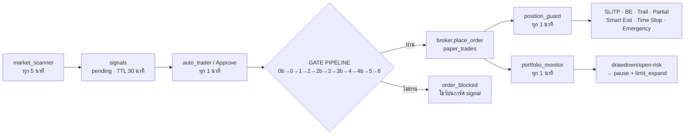

# tdapp — หลักการ กลยุทธ์ การเปิด–ปิดออเดอร์ (STRATEGY)

> อัปเดตล่าสุด: 2026-09-23 · เอกสารนี้รวบรวม **หลักการ + กลยุทธ์ + เกณฑ์ตัวเลขจริง** ของการเปิดออเดอร์ (entry) และปิดออเดอร์ (exit) รวมถึงการบริหารความเสี่ยงของระบบ
> เอกสารเทคนิคอื่น: `FEATURES.md` (สรุปฟีเจอร์), `README.md` (quick start), `UI-DESIGN-SYSTEM.md` (ดีไซน์), `database/*.sql` (migration 001–050)
>
> ⚠️ **ค่าที่ใช้จริงใน production มาจากแถว `trading_settings` ใน DB** (ไม่ใช่ ENV/default ในโค้ด) — ตัวเลขในเอกสารนี้คือ **default ในโค้ด (`AppSettings`)** และ **preset** ตรวจค่าจริงด้วย `backend/scripts/check_config.py`
> ⚠️ **Entry mode ปัจจุบัน**: `entry_mode` (`auto`/`confirm`/`advisory`) + `position_management_mode` (`auto`/`protective_only`/`advisory`) แยกอิสระ — `order_mode` เก่า (`auto`/`semi_auto`/`manual`) เป็น fallback เท่านั้นผ่าน `effective_entry_mode()`

---

## 1. ปรัชญาหลักของระบบ

| หลักการ | ความหมาย |
|---|---|
| **Single Path** | ปุ่ม Approve (manual) และ Auto Trader ใช้ `execution.execute_signal` **เส้นทางเดียวกัน** — ไม่มี logic ซ้อนกัน |
| **Fail-Closed** | ทุกจุดตัดสินใจที่ข้อมูลไม่ครบ (ตลาดปิด / อ่าน settings ไม่ได้ / อ่าน book ไม่ได้) → **บล็อกไว้ก่อน** ไม่เดา |
| **Confirm-before-Kill** | ละเมิดลิมิต → **ไม่ปิดทันที** แต่ถาม user ก่อน (LINE + Web popup + Web Push) แล้วรอ confirm |
| **Deterministic** | คะแนน/การตัดสินใจคำนวณจาก indicator จริง ไม่สุ่ม — snapshot `source != "live"` **ห้ามออก signal** |
| **Capital Efficiency** | ไม้ที่ไม่ไปไหนต้องถูกตัดออก (left-behind / time stop) เพื่อคืนทุนไปหาช่องใหม่ |
| **Tighten-only** | การปรับ SL (breakeven / trailing / SL risk cap) **กระชับขึ้นเท่านั้น** ไม่มีทางผ่อนออก |

---

## 2. Pipeline การเทรด (Scanner → Gate → Execution → Guard)



| Worker | ทุก | หน้าที่ |
|---|---|---|
| `market_scanner` | 5 นาที | วิเคราะห์ → score + signal pending |
| `news_analysis` | 15 นาที | CPI/GDP/NFP/FOMC/geopolitics → sentiment |
| `portfolio_monitor` | 1 นาที | drawdown/open-risk → auto-pause/close/notify |
| `notifications` | 1 นาที | ส่งคิว LINE + Web Push (critical = ทันที) |
| `auto_trader` | 1 นาที | เปิด order อัตโนมัติผ่าน gate |
| `position_guard` | 1 นาที | breakeven/trailing/partial/time-stop/smart-exit |
| `calendar_sync` | 6 ชม. | sync ปฏิทินข่าว → news block/caution |
| `daily_digest` | 60 นาที | สรุปประจำวัน |
| `log_maintenance` | 10 นาที | purge log เกิน TTL |

**โหมดเทรดปัจจุบัน** (`entry_mode` / `position_management_mode`, P1-2): entry `auto` (AI เปิดเอง) · `confirm` (AI เสนอ → คนกดอนุมัติ) · `advisory` (วิเคราะห์อย่างเดียว) — legacy `order_mode` (`auto`/`semi_auto`/`manual`) map เป็น `auto→auto`, `semi_auto→confirm/protective_only`, `manual→advisory/advisory` เฉพาะแถวเก่าที่ `entry_mode=""`

---

## 3. 🟢 หลักการเปิดออเดอร์ (ENTRY)

### 3.1 การให้คะแนนโอกาส — `strategy_engine.opportunity_score(ind, direction=None)`

คะแนน 0–100 (clamp `max(0, min(100, score))`) จาก 8 องค์ประกอบ — **symmetric BUY/SELL** (`_resolve_direction()`: auto-detect จาก EMA ไม่งั้น Supertrend; `want=True` = BUY, `False` = SELL):

| องค์ประกอบ | เงื่อนไข | คะแนน |
|---|---|---|
| **Trend** | EMA สอดคล้องฝั่งที่ต้องการ (`trend_up == want`) | **+20** (สวนทาง **−5**) |
| | `adx ≥ 25` / `adx > 0` (คือ < 25) | +15 / +5 |
| **Momentum (bull/BUY)** | `40 ≤ rsi ≤ 55` **และ** `supertrend_dir > 0` (pullback) | **+15** |
| | `55 < rsi ≤ 70` (chase) | +5 |
| | `rsi > 70` (overbought) | +5 |
| | `rsi < 40` + ST up | +8 |
| **Momentum (bear/SELL, mirror)** | `45 ≤ rsi ≤ 60` + ST down | **+15** |
| | `30 ≤ rsi < 45` | +5 |
| | `rsi > 60` + ST down | +8 |
| | `rsi < 30` | +5 |
| **MACD (symmetric)** | histogram สอดคล้องฝั่ง (`(macd>0)==want`) | **+10** / สวนทาง **−10** (SELL ให้ bonus เมื่อ `macd<0`) |
| **Volatility** | `0.4 ≤ atr_pct ≤ 1.5` | **+15** |
| | `atr_pct > 2.5` | **−10** |
| | อื่น ๆ | +5 |
| **News (signed)** | `signed_sentiment × 10` (clamp ±10) โดย `signed = sentiment × (+1 BUY / −1 SELL)` — ข่าว bearish ช่วย SELL | ±10 |
| | `high_impact_event` / ปกติ | **−5** / +5 |
| **Confirm (symmetric)** | `(ST>0)==want and (macd>0)==want` | +5 |
| **Strategy D (symmetric)** | `breakout_state == 2` สอดคล้องฝั่ง (breakout สำหรับ BUY / breakdown สำหรับ SELL) | **+5** |
| | `breakout_state == 1` สอดคล้องฝั่ง (retest / retest-breakdown) | +3 |
| | breakout ผิดทิศ | +0 (ไม่นับ bonus) |

**Bands** (`BANDS`): very_high 81–100 · high 61–81 · medium 31–61 · low 0–31

**Confidence** (`evidence_confidence()`, P1-3 — แยกจาก opportunity โดยตั้งใจ): `base = min(max(score,0), 45.0)` + `ratio × 55.0` โดย `ratio = (agree+total)/(2×total)` จาก 6 แหล่งอิสระ (EMA / ADX≥25 / Supertrend / MACD / RSI-zone 40–70 BUY หรือ 30–60 SELL / sentiment-signed) + breakout สอดคล้องฝั่ง `+10` / retest `+5` · `high_impact_event` → **−30** · clamp `max(10, min(100))` พร้อม `confidence_reasons[]` อธิบายรายแหล่ง — legacy `_confidence(score, ind)` เป็น shim เรียกฟังก์ชันนี้

**Decision** (`_decision`): `high_impact_event` → `WAIT` · `≥70` → `TRADE` · `≥50` → `WAIT` · `<50` → `REDUCE RISK`

**Regime** (`regime_of`): `high_impact_event` → `news_driven_market` · `adx < 20` → `sideway` · `atr_pct > 2.5` → `high_volatility` · `ema_fast > ema_slow` → `bull_trend` (`adx < 35`) / `strong_bull_trend` · else `bear_trend` / `strong_bear_trend`

### 3.2 การสร้าง SL / TP — `strategy_engine.build_proposal()`

- `sl_distance = max(price × atr_pct/100 × atr_multiple_sl, price × 0.001)` — default `atr_multiple_sl = 1.5`
- **SL clamp** (`sl_min_pct` / `sl_max_pct` ในโค้ด, migration 025): ใช้เฉพาะเมื่อ `invalidation_level <= 0` — default **0.0 / 0.0 = ปิด**
- **Strategy D structural stop** (`invalidation_level > 0`, โค้ดไม่ล็อกทอง — ใช้ได้ทุก asset): `invalidation_sl = breakout_level ∓ 0.5 × ATR` → `sl_distance = max(|price − invalidation_sl|, 0.5×ATR, price×0.001)` — **ยกเว้น clamp**
- `stop_loss = price − sign × sl_distance` · `take_profit = price + sign × sl_distance × rr_target`
- **RR target** (`rr_target`) default **1.5** (aligned moderate 2026-09-23) — โค้ดใช้ค่าดิบ ไม่ clamp (ไม่มี `max(0.5, …)` ใน `build_proposal` ปัจจุบัน)
- **Limit ladder** (`limit_ladder`): 3 ขั้นที่ `−0.25 / −0.50 / −0.75 × sl_distance` (BUY ต่ำกว่าตลาด, SELL กลับด้าน) แบ่งความเสี่ยง **40 / 35 / 25 %** — แต่ละขั้นคง SL distance และ RR เดิม
- **SL/TP tier preview** (`sltp_preview`): สั้น ×1.0 / กลาง ×1.5 / ยาว ×2.0 ATR — แถว signal เก็บราคา **กลาง (×1.5)** เสมอ

### 3.3 Gate ของ Scanner — `market_scanner.scan_once()`

ต้องผ่าน **ทุกข้อ** จึงออก signal:

1. `ind.source == "live"` — snapshot demo/random-walk **ห้ามออก signal**
2. `asset ∈ allowed_assets` — `settings.effective_assets()` (default `quotes.DEFAULT_ASSETS = ["EURUSD","GBPUSD","USDJPY","AUDUSD","XAUUSD"]`)
3. **สองแกน P1-3**: `opp.score ≥ effective_min_opportunity` (base **60.0**) **และ** `opp.confidence ≥ effective_min_confidence` — base `min_confidence` **70.0**, override ทอง `min_confidence_gold` (None → base)
4. **Strategy D gold gate**: `asset == "XAUUSD" and gold_breakout_only and ind.breakout_state <= 0` → ข้าม — `gold_breakout_only` default **True** (migration 024) · breakout = ปิดเหนือ high 20 แท่งก่อนหน้า, retest = ย่อกลับแล้วปิดเหนือ
5. `not _market_is_closed` — ปิด weekend
6. `asset not in pending_assets` — pending-dedup (ไม้ **OPEN** อยู่ **ไม่** บล็อก signal ใหม่)
7. `FrequencyEngine.evaluate(...)` — ลิมิต **ไม่** หยุด signal แค่หยุด execution (การ์ดที่ถูกบล็อกมี `⏸ …` ต่อท้าย `explanation` จาก `blocked_reason` ของ scanner + `order_blocked` จาก execution gate §3.4 ที่ API derive live)
8. Re-anchor entry/SL/TP กับราคา live ผ่าน `fetch_trusted_spot` (ปฏิเสธ fallback rate รายวัน)

### 3.4 Gate Pipeline ก่อนเปิดจริง — `execution._gate_blocked()`

ลำดับ (แต่ละข้อ append เข้า `rejects`; `allowed = not rejects`):

| # | Gate | เงื่อนไข | Default |
|---|---|---|---|
| **P0-4** | Config validation | settings อ่านไม่ได้ / ไม่ครบ → block (fail-closed รอบ `execute_signal`) | — |
| **0b** | ตลาดปิด | `market_closed_block()` — hard rule, ไม่ใช่ setting, fail-CLOSED | — |
| **0** | Pause | `get_pause(db).paused` (แถว `trading_pause`) | — |
| **1** | Kill switch | `evaluate_kill(db, s)` (default `settings_confirmed=True`; fail-safe defer เฉพาะ caller ที่ส่ง `False` มาอย่างชัดแจ้ง) | ดู §5.2 |
| **2** | Frequency | `confidence < min_confidence` · `opportunity < min_opportunity` (**60.0**) · `trades_today ≥ max_trades_daily` · `trades_week ≥ max_trades_weekly` · `open_positions ≥ max_open_positions` · `drawdown > drawdown_throttle_pct` (หมายเหตุ: execution ส่ง `regime="bull_trend"` คงที่ — throttle sideway/high_vol/news อยู่ที่ scanner/FrequencyEngine ไม่ใช่ gate นี้) | 10/30/12 · throttle 5.0 |
| **2b** | **Re-entry cooldown** | นาทีจาก `paper_trades.closed_at` ล่าสุดของ asset เดียวกัน | **30 นาที** (migration 040) |
| **P0-2** | Min-lot budget | `risk_to_lot < min_lot` แม้หลัง SL-cap → block (กันฝืนเปิดไม้ที่เสี่ยงเกินงบ) | — |
| **P0-6** | Spread vs SL | `sl_distance < spread × SPREAD_SL_FLOOR_MULT (3.0)` → block | — |
| **P0-5** | Thesis validation | thesis ขัดกับทิศ/indicator → block | — |
| **3** | News | `_news_risk` → `DANGER` บล็อก | `news_block_minutes` **30** |
| **3b** | Pre-open | (1) spread guard `spread / SL_dist × 100 > spread_guard_max_pct` · (2) pre-news flatten: high-impact ของสกุลคู่ภายใน `pre_news_flatten_min` · (3) session filter: session สภาพคล่องต่ำเท่านั้น | **25 %** · **30 นาที** · `session_filter_enabled=True` |
| **4** | Correlation | `CorrelationEngine().portfolio_correlation(assets) > correlation_cap` | **80.0** |
| **4b** | Currency exposure | `ExposureEngine.currency_risk` — risk-at-stop ต่อสกุล+ทิศ (book เปิด + candidate) vs `max_currency_exposure_pct` ของ capital | **50.0 %** (migration 041) |
| **5** | Risk officer | `RiskOfficer.review_trade` — `confidence < min_confidence` · `opportunity < min_opportunity` (**60.0**) · frequency · news DANGER · kill engaged · correlation > cap | — |
| **6** | Portfolio heat | `open_risk% + new_trade_risk% > kill_daily_loss_pct` | **2.0 %** |

> `order_blocked` บนการ์ด = `rejects[:2]` ทุกกรณีที่ execution บล็อก (ไม่ใช่แค่ 2 เหตุผลแรกของ pipeline)

### 3.5 Sizing & Fill — `execution.size_position` / `execute_signal`

- `lots = risk_to_lot_for(capital, risk_per_trade_pct, stop_distance, asset)` → floor ที่ `effective_min_lot(s, asset)`
- `risk_to_lot = equity × risk_pct/100 / (stop_distance × contract_value)` · `contract_value_for`: **XAUUSD = 100.0**, อื่น ๆ **100 000.0**
- `min_lot` default **0.01** · `min_lot_gold` override (None → base)
- **SL risk cap** (`sl_cap_enabled`, default **True**, migration 035): `sl_cap_distance = budget / (min_lot × contract)` โดย `budget = capital × risk_per_trade_pct/100` — **tighten-only**, TP คำนวณใหม่ที่ RR เดิม
- **SL distance mode** (`sl_distance_mode`, default `"medium"`): `SL_TIER_MULT = {"short": 1.0, "medium": 1.5, "long": 2.0}`
- **Fill**: `apply_spread(entry, direction, effective_spread)` — BUY `+spread/2`, SELL `−spread/2`
- **Spread resolution** (`effective_spread`): user `spread_overrides[ASSET]` → `DEFAULT_SPREADS[ASSET]` (EURUSD 0.00010 · GBPUSD 0.00015 · USDJPY 0.015 · XAUUSD **0.30**) → legacy `paper_spread`
- **Live re-anchor**: `fetch_trusted_spot` เลื่อน entry/SL/TP ตามสัดส่วนก่อนเข้า gate
- **Signal TTL**: `SIGNAL_TTL_MIN = 30` นาที → `expired`

### 3.6 Auto Trader — `auto_trader.trade_once()`

- ทำงานเฉพาะ `entry_is_auto()` (`effective_entry_mode() == "auto"`; legacy `order_mode == "auto"` เท่านั้นที่ map มา — `semi_auto/manual` เดิม = `confirm/advisory` → ไม่เปิด แต่ยัง expire signal เก่า)
- หยิบสูงสุด **10** `signals` ที่ `approval="pending"`
- **Fail-closed duplicate guard**: อ่านไม้เปิด `paper_trades` ผ่าน `select_ex` — อ่าน error = **abort ทั้งรอบ** · merge book ของ broker เป็นแหล่งที่สอง · ข้าม asset ที่เปิดอยู่แล้ว
- ปฏิเสธ `entry <= 0`
- เรียก `execution.execute_signal(...)` — เส้นทางเดียวกับ `/approve` · เมื่อ `allowed` ตั้ง `approval="approved"` + `approved_at`

---

## 4. 🔴 หลักการปิดออเดอร์ (EXIT)

### 4.1 ลำดับความสำคัญ — `position_guard.guard_once()` + `smart_exit.py`

```
1. Emergency Exit (kill switch, defer ขณะ kill_expand pending — เฉพาะ settings-write "failed")
2. คำนวณ SL/TP mark ก่อน แต่ปิดทีหลัง (hard-stop-wins: ถ้าโดน SL/TP ข้าม discretionary ทั้งหมด)
3. Partial close (TP1) → Breakeven → Trailing + R-ladder floor
4. Smart Exit เดี่ยว (รวม AI Exit Score + Trend Reversal + News Exit ใน evaluate_exit เดียว)
5. Time Stop (R-exemption ช่วยไม้กำไร)
6. Market-closed gate บล็อกทุกเส้นทางปิด (fail-CLOSED)
```

> §นี้เดิมแยก Reversal/News เป็นข้อเอง — โค้ดจริงรวมทั้งสามไว้ใน Smart Exit (§4.2) แล้ว guard เรียกครั้งเดียวหลัง BE/trail

### 4.2 Smart Exit — `smart_exit.evaluate_exit()` (pure, fail-safe HOLD)

**9 ปัจจัย (0–100, สูง = ปลอดภัยที่จะถือต่อ) + น้ำหนัก:**

| ปัจจัย | น้ำหนัก | เกณฑ์เด่น |
|---|---|---|
| trend_strength | **0.20** | aligned + ST + `adx≥25` → 90 · aligned + `adx≥20` → 70 · aligned → 55 · `adx<20` → 35 · else 20 |
| momentum | **0.15** | BUY: `rsi≥55 & macd>0` → 80 · `rsi≥45 & macd≥0` → 65 · `rsi<40 or macd<0` → 30 · `rsi>75` → 45 (dead-branch: ถูก `≥55/≥45` ดักก่อน) · SELL mirror: `rsi≤45 & macd<0` → 80 · `rsi≤55 & macd≤0` → 65 · `rsi>60 or macd>0` → 30 · `rsi<25` → 45 |
| market_regime | **0.15** | aligned trend → 85 · sideway → 35 · high_vol/news → 25 · counter-trend → 30 (ว่าง → derive จาก `adx<20`/`atr>2.5`/EMA; unknown → 60) |
| opportunity_score | **0.10** | `clamp(opp, 0, 100)` |
| news_risk | **0.10** | SAFE 85 / CAUTION 55 / DANGER 20 / unknown 60 |
| holding_time | **0.10** | `frac = age/max_hold`: <0.4 → 85 · <0.7 → 65 · <1.0 → 40 · else 15 (`max_hold≤0` → `age<10`=70 / `<20`=50 / else 30) |
| volatility | **0.10** | `0.4 ≤ atr_pct ≤ 1.5` → 80 · ≤2.5 → 55 · else 25 (`atr≤0` → 50) |
| volume_proxy | **0.05** | `3 ≤ vol_idx ≤ 12` → 75 · <3 → 45 · ≤20 → 40 · else 25 |
| risk_exposure | **0.05** | dd ≤0 → 85 · <2 → 65 · <5 → 40 · else 20 |

**คุณภาพ** (`quality_of`): **≥65 High · ≥45 Medium · <45 Low**

**บันไดคำแนะนำ** (first match wins):

1. **left_behind** → `CLOSE` — `r_mult < no_behind_min_r` (**0.5**) **และ** `age_days > behind_days`
2. **news_exit** → `CLOSE` — `news_exit_enabled` และ status `DANGER` และ `r_mult ≥ news_exit_min_r` (**1.0**)
3. **reversal** → `CLOSE` — `reversal_votes >= 2` จาก 4: EMA50/200 สวน · `0 < adx < 20` · MACD พลิก · `opp < reversal_opp_min` (**50.0**)
4. **exit_score < exit_score_close** (**45.0**): `r_mult ≥ 1.0` → `PARTIAL_50` · ไม่ถึง → `CLOSE`
5. **volatility_spike** (`atr_pct > volatility_exit_atr` **2.5**): `r_mult ≥ 1.0` → `PARTIAL_50` · ไม่ถึง → `PARTIAL_25`
6. **profit_protect** (`r_mult ≥ profit_protect_r` **2.0** และคุณภาพ ≠ High) → `PARTIAL_50`
7. `r_mult ≥ 1.0` และคุณภาพ == Low → `MOVE_SL` / `PROTECT`
8. else `HOLD`

**`left_behind_days(settings, avg_hold_days, max_hold_days)`:**

```
days = max(avg_hold × no_behind_hold_mult, no_behind_min_days)
days = min(days, max_hold_days)   # เฉพาะเมื่อ time stop เปิด
```

`no_behind_hold_mult` default **1.75** · `no_behind_min_days` **2.0** · `avg_hold` floor **0.5** วัน · คืน 0.0 (ปิด) เมื่อ mult ≤ 0

**`ladder_sl(...)`** (R-ladder floor): `≥1R → breakeven` · `≥2R → +1R` · `≥3R → +2R` · `None` ต่ำกว่า 1R

### 4.3 Position Guard — `position_guard.guard_once()` (ทุก 1 นาที)

ลำดับต่อไม้:

| ลำดับ | การจัดการ | เงื่อนไข |
|---|---|---|
| 1 | **Emergency Exit** | kill engaged → ปิดทั้งหมด — **defer** ขณะมี `kill_expand` ค้างที่ยังไม่ตอบ · **block** เมื่อตลาดปิด |
| 2 | **Partial close (TP1)** | `partial_close_pct > 0` และ `r_multiple ≥ partial_trigger_r` (**1.0**) และยังไม่ `partial_done` → ปิด `partial_close_pct` % (default **0.0 = ปิด**) |
| 3 | **Breakeven** | `r_multiple ≥ breakeven_trigger_r` (**1.0**) → SL มาทุน |
| 4 | **Trailing** | `trail_price = price − sign × trail_atr_mult × atr` โดย `atr = 0.2 × |entry − initial_stop_loss|` · `trail_atr_mult` default **2.0** — กระชับขึ้นเท่านั้น (ไม่หลวมกว่า SL ปัจจุบัน, ไม่เลย breakeven) |
| 5 | **R-ladder floor** | เมื่อ `trailing_ladder` (default **True**) |
| 6 | **SL/TP hard stops** | `hit_sl` / `hit_tp` บน mark live |
| 7 | **Smart Exit** | เมื่อไม่มี hard stop และมี snapshot (ไม่มี = blind HOLD) |
| 8 | **Time stop** | `age_days ≥ max_hold_days` (**5**) **และ** `r_now < time_stop_min_r` (**1.0**) → ปิด (R-exemption ช่วยไม้ที่กำไรอยู่) |
| 9 | **Market-closed gate** | `market_closed_discretionary_close_block` บล็อก **ทุก** เส้นทางปิด (Smart Exit, time stop, TP1, SL/TP, emergency) — fail-CLOSED |

> **R-multiple ใช้ `initial_stop_loss` เสมอ** (migration 021) ไม่ใช่ SL ปัจจุบัน — กันค่า R เพี้ยนหลังย้าย SL
> **Age** = `market_open_days_between(created_at, now)` — วันทำการ หัก weekend (ศ. 21:00 UTC → อา. 21:00 UTC = 2.0 วัน/weekend)
> **`avg_hold_days`** (`execution.avg_hold_days`): ค่าเฉลี่ยช่วงวันทำการของแถวปิด · ตัด span `< 0.05` วัน · ต้องมี `≥ 3` แถวที่ใช้ได้ · fallback **4.0**

### 4.4 Manual close

- `backend/app/models/close_position.py` · `execution.market_closed_close_block` — ปิดมือถูกบล็อกขณะตลาดปิด · `close_reason` default `"manual"`

---

## 5. 🛡️ การจัดการความเสี่ยง (RISK)

### 5.1 Risk Engine — `risk_engine.py`

Default (% ของ equity): `risk_per_trade` **0.5** · `max_daily_loss` **2.0** · `max_weekly_loss` **5.0** · `max_monthly_loss` **8.0** · `max_drawdown` **10.0**

`RiskEngine.check(snap)` ละเมิดเมื่อ:

- `daily_loss_pct >= max_daily_loss_pct` (หารด้วย `starting_capital`)
- `weekly_loss_pct >= max_weekly_loss_pct` (หารด้วย `starting_capital`)
- `monthly_loss_pct >= max_monthly_loss_pct` (หารด้วย `starting_capital`)
- `drawdown_pct >= max_drawdown_pct` (หารด้วย `peak_equity`)
- **open-risk guard**: `open_risk_pct + risk_per_trade_pct > max_daily_loss_pct` (`open_risk` หารด้วย `current_equity`)

ละเมิด → `pause()` + `"TRADING PAUSED — MANUAL REVIEW REQUIRED"`

`_level`: paused หรือ `dd ≥ 8` → critical · `≥5` high · `≥2` medium · else low

`position_size(equity, entry, sl, contract)` = `equity × risk_pct/100 / (|entry−sl| × contract)`

`risk_engine_for_settings(s)` อ่านแถว DB (`kill_daily_loss_pct` ฯลฯ) — **ไม่ใช่** ENV default

### 5.2 Kill Switch — `schemas.KillSwitchEngine` + `execution.evaluate_kill`

Trigger (strict `>`): `daily_loss_pct > kill_daily_loss_pct` (**2.0**) · `weekly > kill_weekly_loss_pct` (**5.0**) · `monthly > kill_monthly_loss_pct` (**8.0**) · `drawdown > max_drawdown_pct` (**10.0**) + สุขภาพระบบ (`broker_connected`, `market_data_ok`, `ai_provider_ok`, `execution_ok`)

`evaluate_kill(..., settings_confirmed=True)` → **engaged** พร้อม "settings unreadable" เฉพาะ caller ที่ส่ง `settings_confirmed=False` อย่างชัดแจ้ง (fail-safe defer — **ไม่ปิดจากลิมิตที่เดา** บทเรียน incident 2026-09-22) — default `True` หมายถึง monitor path ปกติจะไม่ fail-safe ถ้าอ่าน settings ไม่ได้ ต้องอาศัย guard ที่ส่ง flag ชัดเจน

`kill_metrics(db, capital)` = `_loss_pcts` (daily 1d / weekly 7d / monthly 30d จาก `paper_trades.closed_at`) + `equity_drawdown_pct` (peak-to-current จาก `equity_snapshots`, peak เก่ากว่า 3× capital ปัจจุบันถูกเมิน)

### 5.3 Limit Expansion — `limit_expand.py` (Confirm-before-Kill)

- `EXPAND_STEP_PCT = 5.0` — **+5 percentage points** ต่อการยืนยัน ใช้กับทุกลิมิตที่ละเมิด · ลิมิต **ไม่เคยถูกเขียนลง**
- `PENDING_TTL_MIN = 180.0` (Settings `kill_expand_ttl_min`, migration 037) · clamp `[5, 10080]` นาที
- `REASK_COOLDOWN_MIN = 30.0` · `REASK_AFTER_REJECT_MIN = 120.0`
- `kill_expand_auto_apply` (migration 039, default **True**): True → apply ทุกครั้งที่หมดเวลา · False → apply **ครั้งเดียว** ต่อ `ONCE_QUOTA_HOURS = 24.0` ชม. แล้ว `capped` (guard ปิด)
- `kill_expand_auto_widen` (migration 043, default **False**, P0-3 fail-closed): **False (default ปัจจุบัน) → หน้าต่างหมดเวลา = `kept` — ไม่ widen เลย คงลิมิตเดิม + คง pause + warn ครั้งเดียว** · True ถึงจะเข้า flow `apply/once/capped` ของ 039 ข้างบน — §นี้ทั้ง section อธิบายกรณี `True` เท่านั้น
- `TRIGGERS` ลำดับ: **drawdown → daily → weekly → monthly**
- `HOLD_KINDS = ("failed",)` — เฉพาะ settings write ที่ล้มเหลวเท่านั้นที่ยัง defer emergency exit
- คำอนุมัติ: `approve/approved/dd_ok/yes/ok/อนุมัติ` · ปฏิเสธ: `reject/rejected/dd_no/no/ไม่อนุมัติ`

**Flow:** ละเมิด → pending row ใน `kill_expand_requests` → LINE prompt (Approve/Reject + `/dd_ok` `/dd_no`) + Web popup + Web Push → อนุมัติ = เขียนลิมิต (+5pp) + `set_pause(False)` แล้ว re-evaluate — ถ้ายัง engaged จะ pause ซ้ำ · ปฏิเสธ = คงลิมิต + pause · ไม่ตอบ = `timeout_plan()`: default (`auto_widen=False`) = `kept` ไม่ widen; เฉพาะ `auto_widen=True` ถึง auto-apply หลัง `kill_expand_ttl_min` (180) · Guard **defer** emergency exit ตลอดหน้าต่าง

### 5.4 Portfolio Monitor — `portfolio_monitor.monitor_once()`

- Settle expand window ที่หมดอายุ **ก่อน** ตัดสินบัญชี
- เขียน `equity_snapshots` แบบ dedup รายวัน UTC (แถวเดียวต่อวัน — วันเดียวกัน update ทับ)
- `open_risk = Σ |entry − SL| × volume × contract` (แปลง USD + ข้ามไม้ volume 0)
- `risk_engine_for_settings(s).check(snap)` **+** bridge ไป `execution.evaluate_kill` (แก้ divergence 2026-09-22)
- ละเมิด → `write_audit("limit_breach")` → `set_pause(True, reason)` → LINE `risk_warning` → `limit_expand.request_and_notify`
- **Early warning**: `DRAWDOWN_APPROACH_RATIO = 0.8` — dd ≥ 80 % ของลิมิต → `drawdown_warning` (throttle ด้วย `DRAWDOWN_APPROACH_COOLDOWN_MIN = 360.0` นาที)

### 5.5 Risk Presets — `schemas.RISK_PRESETS` (42 ฟิลด์, `apply_risk_preset`)

| ฟิลด์ | conservative | **moderate (prod)** | aggressive |
|---|---|---|---|
| max_trades_daily / weekly | 5 / 15 | **10 / 30** | 15 / 50 |
| max_open_positions | 6 | **12** | 18 |
| risk_per_trade_pct | 1.0 | **2.0** | 3.0 |
| reentry_cooldown_min | 60 | **30** | 15 |
| min_confidence / min_opportunity | 72 / 65 | **65 / 60** | 60 / 55 |
| gold_breakout_only | True | **True** | False |
| sl_distance_mode | short | **short** | short |
| rr_target | 1.5 | **1.5** | 1.2 |
| sl_distance_min/max_pct | 0.3 / 0.8 | **0.3 / 0.8** | 0.2 / 1.2 |
| sl_cap_enabled | True | **True** | False |
| breakeven_trigger_r | 0.8 | **1.0** | 1.5 |
| trail_atr_mult | 1.2 | **1.5** | 2.0 |
| partial_close_pct / trigger_r | 50 / 1.0 | **50 / 1.0** | 30 / 1.5 |
| max_hold_days | 3 | **5** | 10 |
| exit_score_close | 60 | **56** | 45 |
| profit_protect_r | 1.0 | **1.5** | 2.5 |
| reversal_opp_min | 55 | **50** | 40 |
| news_exit_min_r | 0.7 | **1.0** | 1.5 |
| volatility_exit_atr | 1.8 | **2.0** | 3.0 |
| no_behind_min_r / mult / min_days | 0.4 / 1.25 / 1.5 | **0.5 / 1.75 / 2.0** | 0.2 / 3.0 / 4.0 |
| time_stop_min_r | 1.5 | **1.0** | 0.5 |
| max_drawdown_pct | 10 | **15** | 25 |
| kill_daily / weekly / monthly | 1.5 / 4 / 6 | **1.5 / 4 / 6** | 3 / 7 / 12 |
| drawdown_throttle_pct | 5.0 | **8.5** | 12.0 |
| correlation_cap | 70 | **80** | 90 |
| news_block / caution min | 45 / 180 | **30 / 120** | 15 / 60 |
| max_currency_exposure_pct | 35 | **50** | 65 |
| spread_guard_max_pct | 18 | **25** | 35 |
| pre_news_flatten_min | 45 | **30** | 15 |
| session_filter_enabled | True | **True** | False |

`TRADE_LIMITS_TABLE` (frequency-only fallback): conservative 3/15/2/0.5 · moderate 6/30/4/1.0 · aggressive 10/50/8/2.0

### 5.6 ต้นทุน Paper Trading — `execution.paper_exit_cost`

- `paper_exit_spread_mult` default **0.5** (ปิด round-trip) · `paper_commission_per_lot` default **3.5** USD/lot/side (round turn = 2×)
- `PaperBrokerPnl.CONTRACT_SIZES = {"XAUUSD": 100.0}` อื่น ๆ 100 000

---

## 6. 📂 แผนที่ไฟล์สำคัญ

| หน้าที่ | ไฟล์ |
|---|---|
| Scoring / Proposal / SL-TP / Ladder | `backend/app/engine/strategy_engine.py` |
| Smart Exit (9 ปัจจัย, left-behind, ladder) | `backend/app/engine/smart_exit.py` |
| Risk Engine (ลิมิต, pause, sizing) | `backend/app/engine/risk_engine.py` |
| Goal / Portfolio engines | `backend/app/engine/goal_engine.py`, `backend/app/engine/portfolio_engine.py` |
| Gate pipeline, sizing, kill eval, cooldown, exposure, market clock, journal | `backend/app/services/execution.py` |
| Limit expansion (+5pp, TTL, auto-apply) | `backend/app/services/limit_expand.py` |
| Signal generation + Strategy D gate | `backend/app/workers/market_scanner.py` |
| Auto-trader | `backend/app/workers/auto_trader.py` |
| Position guard (SL/TP, BE, trail, partial, time stop, emergency) | `backend/app/workers/position_guard.py` |
| Portfolio monitor (drawdown, pause, early warning) | `backend/app/workers/portfolio_monitor.py` |
| Settings model, defaults, presets, engines | `backend/app/models/schemas.py` |
| Manual close schema | `backend/app/models/close_position.py` |
| Settings defaults ใน DB | `database/006_trading_settings.sql`, `012`, `014`–`018`, `023`–`029`, `032`–`041`, `043` (`kill_expand_auto_widen=False`), `051` (`no_behind` default 1.75), `052` (frequency 10/30/12/2.0 + RR 1.5) |
| เอกสาร | `FEATURES.md` (§3 pipeline, §5 engines, §6 position mgmt, §7 costs) |

---

## 7. ⚠️ ข้อสังเกตสำคัญ (default ไม่ตรงกัน)

ค่า `AppSettings` (โค้ด/DB) vs preset `moderate` **ไม่ตรงกันโดยตั้งใจ** (preset มีผลเฉพาะเมื่อเรียก `apply_risk_preset`; fallback frequency ใช้ `TRADE_LIMITS_TABLE` ไม่ใช่ preset) — ต้องตรวจค่าจริงใน DB ก่อนสรุป:

| ฟิลด์ | `AppSettings` (โค้ด/DB) | preset moderate |
|---|---|---|
| `partial_close_pct` | **0.0** (ปิด) | **50.0** |
| `min_confidence` | **70.0** | **65.0** |
| `trail_atr_mult` | **2.0** | **1.5** |
| `rr_target` | **1.5** (aligned 2026-09-23) | **1.5** |
| `sl_min/max_pct` | **0.0 / 0.0 = ปิด** | **0.3 / 0.8** |
| `sl_distance_mode` | **`medium`** | **`short`** |
| `exit_score_close` | **45.0** | **56.0** |
| `profit_protect_r` | **2.0** | **1.5** |
| `volatility_exit_atr` | **2.5** | **2.0** |
| `max_drawdown_pct` | **10.0** | **15.0** |
| `kill_daily/weekly/monthly` | **2.0 / 5.0 / 8.0** | **1.5 / 4.0 / 6.0** |
| `drawdown_throttle_pct` | **5.0** | **8.5** |
| `no_behind_hold_mult` | **1.75** (โค้ด + migration 032 อัปแถว id=1 + 051 แก้ column default) | **1.75** |
| `max_trades_daily/weekly/open/risk_per_trade` | **10 / 30 / 12 / 2.0** (aligned 2026-09-23 — `AppSettings` + `TRADE_LIMITS_TABLE` + preset ตรงกัน) | **10 / 30 / 12 / 2.0** |

> ค่าที่ใช้จริงใน production ขึ้นกับ **แถว `trading_settings` ใน DB** — ตรวจด้วย `backend/scripts/check_config.py`

---

## 8. 🧪 การทดสอบ/ตรวจสอบกลยุทธ์

| เครื่องมือ | หน้าที่ |
|---|---|
| `backend/scripts/check_config.py` | ตรวจค่า settings จริงใน DB |
| `backend/scripts/probe_confirm_before_kill.py` | probe read-only: ตรวจ flow confirm-before-kill บน prod |
| `backend/scripts/sim_confirm_before_kill.py` | replay incident ในหน่วยความจำ |
| `backend/scripts/drill_kill_channels.py` | drill 3 ช่องทาง (LINE + Web Push + popup) ผ่าน shim DB |
| `backend/scripts/probe_line_expand_roundtrip.py` | round-trip จริงผ่าน LINE (`ask` / `wait` / `cleanup`) |
| `backend/tests/test_kill_switch_channels_e2e.py` | unit test 3 ช่องทาง (10 เคส) |
| `backend/tests/` | pytest รวม (cooldown, ticket-recycling, smart-exit, RR, costs, web-push ฯลฯ) |
